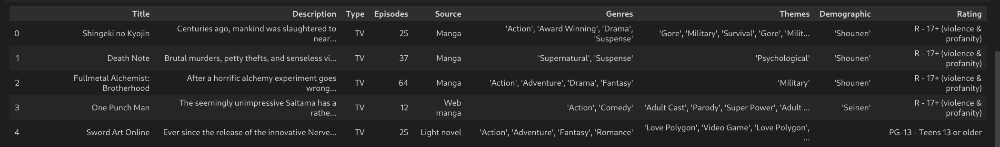

# Getting Data on the most popular anime through web scraping

It gives us one function which return dataframe with data of most popular anime: get_anime_data()

We can use it in this way:
```sh
get_anime_data(max)
```
max specifies the maximum number of records retrieved and is rounded to the nearest multiple of 50

## Example


